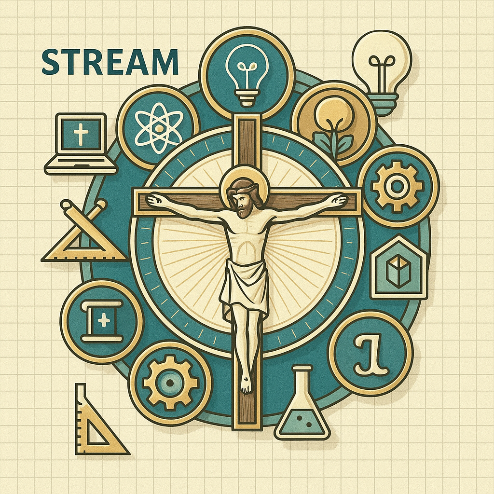

<div style="display: flex; align-items: flex-start; margin-bottom: 20px;">
  
  <div style="max-width: 600px;">
    <h1 style="margin-top: 0;">C-STREAM Framework</h1>
    <p><strong>C</strong>atholic · <strong>S</strong>cience · <strong>T</strong>echnology · <strong>R</strong>eligion · <strong>E</strong>ngineering · <strong>A</strong>rts · <strong>M</strong>ath</p>
    <p>A local Catholic C-STREAM program integrating faith and reason, hands-on inquiry, responsible design, creativity and service.</p>
  </div>
</div>

**Location:** Our Lady of the Prairie Catholic School · Belle Plaine, MN · Archdiocese of Saint Paul and Minneapolis

## 2026-27 curriculum review

Start with [the curriculum review](docs/Review/README.md) for the executive
review, verified standards sources, local competencies, K-6 progression, all
251 lesson audit records, classroom materials, revised lesson pathways and
remaining teaching-release checks. This is a local program, not an
Archdiocesan-approved standards framework. The expanded teacher-artifact audit
now confirms repository artifact coverage for all 251 lessons. Classroom
release still requires local equipment, product/service approval,
accommodation, second-adult review and pilot checks.

From the repository root in PowerShell, regenerate and validate the maps with
`.\scripts\Build-CurriculumMaps.ps1` and
`.\scripts\Build-OperationalAudit.ps1`, then publish locally with `mkdocs build`.
See [source documentation](docs/README.md) for dependency and preview commands.

| [📜 License](./LICENSE.html) | [🤝 Contributing](./CONTRIBUTING.html) |

---

## ⏱️ Lesson Time Frames by Grade

| Grade Level | Session Length | Notes |
|-------------|----------------|-------|
| **Kindergarten** | 25 minutes | Focus on wonder, exploration, simple hands-on activities |
| **Grades 1-2** | 30 minutes | Guided exploration with structured activities |
| **Grades 3-4** | 40 minutes | Independent work with collaboration opportunities |
| **Grades 5-6** | 45 minutes | Complex projects, deeper investigation, student-led inquiry |

---

## 📆 Scheduling Flexibility

C-STREAM offers two scheduling options to fit your school's needs:

| Schedule | Sessions | Best For |
|----------|----------|----------|
| **[Weekly Lessons](./Lessons/)** | 34 lessons per year | Schools with dedicated weekly STREAM time |
| **[Bi-Weekly Lessons](./Lessons/Bi-Weekly/)** | 17 sessions per year | Schools with STREAM every other week |

### Two-Year Rotation (Grades 1-6)
For combined-grade classrooms, we offer **Year A** and **Year B** versions:
- **Year A & Year B** cover the same core skills with different projects, saints, and contexts
- Core skills recur with increasing independence; consult the grade reviews for overlapping projects and prerequisites.
- Kindergarten has a single track (students only experience it once)

### Curriculum Structure

```
Lessons/
├── Weekly (34 sessions)
│   ├── Kindergarten/
│   ├── Grades_1-2_YearA/
│   ├── Grades_1-2_YearB/
│   ├── Grades_3-4_YearA/
│   ├── Grades_3-4_YearB/
│   ├── Grades_5-6_YearA/
│   └── Grades_5-6_YearB/
│
└── Bi-Weekly (17 sessions)
    ├── Kindergarten/
    ├── Grades_1-2_YearA/
    ├── Grades_1-2_YearB/
    ├── Grades_3-4_YearA/
    ├── Grades_3-4_YearB/
    ├── Grades_5-6_YearA/
    └── Grades_5-6_YearB/
```

---

## 🧭 Quick Navigation

| Planning | Templates | Assessment | Resources |
|----------|-----------|------------|-----------|
| [📅 Year Planner](./C-STREAM_Year_Planner.html) | [📝 Lesson Template](./Templates/Lesson_Plan_Template.html) | [📊 Faith-Reason Rubric](./Rubrics/Faith_Reason_Integration_Rubric.html) | [👨‍🔬 Catholic Scientists](./Resources/Catholic_Scientists_Heritage.html) |
| [📚 Lesson Index](./C-STREAM_Lesson_Index.html) | [🔧 PBL Template](./Templates/Project_Based_Learning_Template.html) | [❤️ Service Rubric](./Rubrics/Service_Oriented_STEM_Rubric.html) | [📦 CSCOE Library Guide](./Resources/CSCOE_Library_Planning_Guide.html) |
| | [🔗 Cross-Curricular](./Templates/Cross_Curricular_Unit_Template.html) | [💡 21st Century Skills](./Rubrics/21st_Century_Skills_Assessment.html) | [🆘 Sub Plans](./Resources/Substitute_Teacher_Guide.html) |
| | | [⭐ Project Rubric](./Rubrics/Student_Project_Rubric.html) | [📬 Parent Sheets](./Resources/Weekly_Parent_Sheet_Template.html) |

---

## What is C-STREAM?

C-STREAM represents **Catholic** STEM education that intentionally weaves together faith and reason throughout every aspect of the curriculum. Rather than treating religion as a standalone subject, this framework integrates Catholic identity like "yeast that causes everything to rise."

The **"A" in C-STREAM** encompasses **Arts** (both visual and musical), with hands-on creation first:
- 🎨 **Visual Art**: Observational drawing, pattern, purposeful model design, composition and visual communication
- 🎵 **Music**: Rhythm, sound investigation, composition and attentive listening

Digital creation tools are extensions when they improve learning, not a
prerequisite. Technology includes tools, systems and unplugged computer science.

> "Science and faith are complementary – the beautiful harmony of faith and reason so students can be a light in the secular world."

---

## The 12 Success Factors

These twelve local design principles guide the program. Consult the
[verified source register](docs/Review/Standards_Sources.md) before making
an official standards, research-validation or accreditation claim.

### 1. 🙏 Faith-Reason Integration (The "R" in C-STREAM)
Present faith and reason as complementary while distinguishing scientific
evidence, theological teaching and a classroom metaphor.

### 2. 📋 NCEA's 10 Characteristics of STREAM Schools
Use a local STREAM reflection checklist. Exact NCEA publication alignment
and any accreditation status are **VERIFICATION REQUIRED**.

### 3. 🔧 Hands-On, Project-Based Learning
Students apply leading-edge technology to "hands-on, minds-on projects" that build critical thinking and collaboration.

### 4. ❤️ Service-Oriented STEM Applications
Connect STEM skills to Catholic social teaching through "Hands and Feet of Christ" projects.

### 5. 🔗 Cross-Curricular Integration
Intentionally connect disciplines – math, science, art, music, religion, and language arts.

### 6. ⚖️ Balance with Traditional Subjects
STEM receives emphasis but not at the expense of other subjects; maintain the whole-child approach.

### 7. 🌱 Start Early
Begin high-quality STEM education as soon as children enter elementary school.

### 8. 👩‍🏫 Teacher Professional Development
Investment in educator training on bringing faith and reason together in the classroom.

### 9. 💡 21st Century Skills Focus
Emphasize problem-solving, communication, collaboration, and critical thinking.

### 10. ⛪ Catholic Heritage in Science
Leverage the Church's rich scientific legacy (Mendel, Copernicus, Pasteur, Lemaître, and more).

### 11. 🤝 Community and Industry Partnerships
External connections with parishes, universities, and industry partners enhance programs.

### 12. ✨ Wonder and Curiosity as Foundation
Approach education from the perspective of wonder, exploration, and faith.

---

## 📅 Year Planning Documents

**Start here for full-year C-STREAM planning:**

| Document | Description |
|----------|-------------|
| **[C-STREAM Year Planner](./C-STREAM_Year_Planner.md)** | Complete 34-week plan with Fall/Winter/Spring structure, lesson types, and grade-specific adaptations |
| **[C-STREAM Lesson Index](./C-STREAM_Lesson_Index.md)** | Searchable index of all lessons by type (single-week, multi-week, long arc) with materials and standards |

### Year at a Glance

| Term | Weeks | Focus |
|------|-------|-------|
| **Fall** | 1-12 | Exploration, wonder, establishing routines |
| **Winter** | 13-22 | Deeper investigation, long-arc projects |
| **Spring** | 23-34 | Application, service projects, celebration |

**Choose one schedule and rotation.** Bi-weekly tracks contain 17 meetings;
weekly tracks use multi-week documents and calendar slots that must be checked
against holidays. Single-week, multi-week and long-arc descriptions are not
additive quotas. See [scope and sequence](docs/Review/Scope_and_Sequence.md).

---

## Framework Contents

### 📁 Templates/
Lesson plan templates and frameworks for creating C-STEM lessons.

- [Enhanced Lesson Plan Template](./Templates/Lesson_Plan_Template.md) - Comprehensive template incorporating all 12 success factors
- [Project-Based Learning Template](./Templates/Project_Based_Learning_Template.md) - Template for hands-on STEM projects
- [Cross-Curricular Unit Template](./Templates/Cross_Curricular_Unit_Template.md) - Multi-subject integration framework

### 📁 Rubrics/
Assessment rubrics aligned with Catholic STEM success factors.

- [Faith-Reason Integration Rubric](./Rubrics/Faith_Reason_Integration_Rubric.md) - Assess faith and science harmony
- [Service-Oriented STEM Rubric](./Rubrics/Service_Oriented_STEM_Rubric.md) - Evaluate Catholic Social Teaching connections
- [21st Century Skills Assessment](./Rubrics/21st_Century_Skills_Assessment.md) - Measure collaboration, critical thinking, communication
- [Student Project Rubric](./Rubrics/Student_Project_Rubric.md) - Comprehensive project evaluation

### 📁 Resources/
Supporting materials for teachers, parents, and substitutes.

#### 🚀 Getting Started
- [**Quick Start Guide**](./Resources/Quick_Start_Guide.md) - **New teachers start here!** Get teaching in your first 2 weeks
- [FAQ & Troubleshooting](./Resources/FAQ_Troubleshooting.md) - Answers to common questions and solutions

#### Teacher Resources
- [Catholic Scientists Heritage](./Resources/Catholic_Scientists_Heritage.md) - Profiles of Catholic scientists for lesson integration
- [Teacher Self-Evaluation](./Resources/Teacher_Self_Evaluation.md) - NCEA alignment checklist
- [Wonder and Curiosity Guide](./Resources/Wonder_Curiosity_Guide.md) - Strategies for cultivating wonder
- [Substitute Teacher Guide](./Resources/Substitute_Teacher_Guide.md) - **Ready-to-use emergency plans** (no prep required!)
- [CSCOE Library Planning Guide](./Resources/CSCOE_Library_Planning_Guide.md) - Material checkout procedures (2-week lead time)
- [Materials Inventory Checklist](./Resources/Materials_Inventory_Checklist.md) - **NEW!** Master supply list for purchasing/budgeting
- [Student Progress Tracker](./Resources/Student_Progress_Tracker.md) - **NEW!** Skills checklists by grade level
- [Differentiation Guide](./Resources/Differentiation_Guide.md) - **NEW!** Strategies for diverse learners
- [Technology Video Links](./Resources/Technology_Video_Links.md) - **NEW!** Tutorial videos for all tech tools

#### Parent Resources
- [Parent Communication Guide](./Resources/Parent_Communication_Guide.md) - Engaging families in C-STREAM with conversation starters and take-home sheets
- [Weekly Parent Sheet Template](./Resources/Weekly_Parent_Sheet_Template.md) - **Ready-to-print weekly take-home sheets** with conversation starters and home activities

### 📁 Student_Resources/
Printable worksheets and templates for students.
- [STREAM Journal Cover](./Student_Resources/STREAM_Journal_Cover.md) - Personalized journal cover
- [My STREAM Goals](./Student_Resources/My_STREAM_Goals.md) - Goal-setting worksheet
- [Engineering Design Process](./Student_Resources/Engineering_Design_Process.md) - Step-by-step design worksheet
- [Wonder Journal Page](./Student_Resources/Wonder_Journal_Page.md) - Daily reflection template
- [Project Reflection](./Student_Resources/Project_Reflection.md) - End-of-project self-assessment

---

## How to Use This Framework

### Quick Start: Year Planning
1. **🚀 Read the [Quick Start Guide](./Resources/Quick_Start_Guide.md)** - Get up and running in 30 minutes
2. **📅 Review the [C-STREAM Year Planner](./C-STREAM_Year_Planner.md)** - See the full 34-week structure
3. **📚 Browse the [Lesson Index](./C-STREAM_Lesson_Index.md)** - Find lessons by type, grade, or topic
4. **📦 Check the [CSCOE Library Guide](./Resources/CSCOE_Library_Planning_Guide.md)** - Request materials 2 weeks ahead
5. **🔧 Use Templates** - Adapt or create lessons using our templates

### For Teachers
1. **Start with the Template**: Use the [Enhanced Lesson Plan Template](./Templates/Lesson_Plan_Template.md) when creating new lessons
2. **Check Your Integration**: Use the [Faith-Reason Integration Rubric](./Rubrics/Faith_Reason_Integration_Rubric.md) to ensure your lesson connects faith and science
3. **Self-Evaluate**: Complete the [Teacher Self-Evaluation](./Resources/Teacher_Self_Evaluation.md) periodically
4. **Prepare for Absences**: Review the [Substitute Teacher Guide](./Resources/Substitute_Teacher_Guide.md) for no-prep backup plans
5. **Track Progress**: Use the [Student Progress Tracker](./Resources/Student_Progress_Tracker.md) to document growth

### For Administrators
1. **Assess Program Alignment**: Use rubrics to evaluate program-wide faith integration
2. **Plan Professional Development**: Identify areas for teacher training using the self-evaluation tools
3. **Track 21st Century Skills**: Monitor student growth using the assessment frameworks

### For Curriculum Developers
1. **Use Templates**: Build new units using the provided templates
2. **Ensure Balance**: Check that new content maintains balance with traditional subjects
3. **Integrate Heritage**: Incorporate Catholic scientific heritage into relevant lessons

---

## Adapting to Your School

This framework is designed to be adaptable for any Catholic school:

| Your Need | C-STREAM Solution |
|-----------|-------------------|
| **New Curriculum** | Use templates to create comprehensive faith-integrated lessons |
| **Existing Curriculum** | Apply rubrics to evaluate and enhance current alignment |
| **Teacher Training** | Use self-evaluation tools for professional development |
| **Parent Engagement** | Utilize parent communication templates and weekly sheets |
| **Assessment** | Implement rubrics for consistent, faith-integrated evaluation |

---

## Local STREAM Reflection Checklist

The following is a local reflection checklist, not a verified official
standard or certification. See the source register before attributing exact
wording or requirements to NCEA.

1. ✅ Integrate Catholic identity into every aspect of the curriculum
2. ✅ Promote a culture of innovation with commitment to ethical behavior
3. ✅ Foster inclusiveness – all students can develop math and science competencies
4. ✅ Encourage problem solving, group collaboration, and independent research
5. ✅ Seek to increase participation of underrepresented groups
6. ✅ Define success in many ways across different learning environments
7. ✅ Use strategic planning as a blueprint for curriculum development
8. ✅ Prioritize educator training, leadership, and 21st-century skill applications
9. ✅ Leverage community and industry partnerships
10. ✅ Approach STEM through the lens of faith and wonder

---

## Recommended Implementation Timeline

| Phase | Timeline | Actions |
|-------|----------|---------|
| **Awareness** | Month 1-2 | Review framework, complete teacher self-evaluation |
| **Pilot** | Month 3-4 | Use templates for 2-3 lessons, gather feedback |
| **Integration** | Month 5-8 | Apply rubrics to assess existing lessons, enhance as needed |
| **Full Implementation** | Year 2 | All new lessons follow framework, regular self-evaluation |

---

## Contributing

We welcome contributions! You can help by:
- Sharing lesson plans created with these templates
- Suggesting improvements to rubrics
- Adding Catholic scientist profiles
- Providing feedback on implementation

See [CONTRIBUTING.md](./CONTRIBUTING.html) for guidelines.

---

## References

The [source register](docs/Review/Standards_Sources.md) distinguishes verified
official standards, guidance, national frameworks and local competencies.
Legacy references to NCEA publications, Cognia certification and Steno
training materials require exact source verification before being used to
claim program alignment. Catholic teaching is traced to primary Church sources.

---

**"Curiosity and critical thinking are fruits of STEM education. Approaching education from the perspective of wonder, exploration, and faith will ignite the love of learning."**

---

*C-STREAM Framework – Integrating Faith and Reason in STEM Education*
