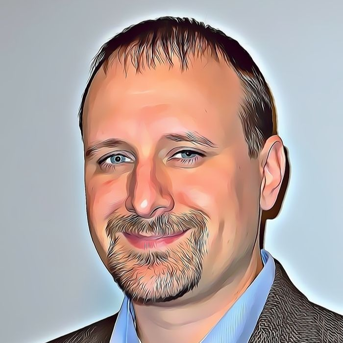

# 👋 About the Author

## Joe Vandermark

{ align=right width=120 }

With more than 30 years in technology, I'm passionate about helping people understand how computers, cloud systems, and new tools make life and work better. I created the C-STREAM Framework to bring that same spirit of innovation into Catholic education—nurturing both the mind and spirit.

!!! quote "My Philosophy"
    STREAM learning gives every student the confidence to explore, ask questions, and build the future with both skill and heart.

---

## 💼 Professional Background

### Technology Leadership

At **Microsoft**, I lead a team of Cloud Solution Architects who help companies build safe and creative solutions in the cloud. I've also authored **two books** on building strong, people-focused teams.

### Entrepreneurship & Wellness

I'm a franchise owner and Chief Operating Officer for **The Vital Stretch** in the Twin Cities, where I'm building wellness studios that help people move better and stay healthy. I love connecting technology, business, wellness, and community in meaningful ways.

### Education & Service

I volunteer as a **STEM teacher** at Our Lady of the Prairie Catholic School, where I help students discover how creativity, science, faith, and problem-solving work together. My background includes:

- Serving on a school board
- Advising early-stage startups
- Studies in computer science, business systems, and Catholic formation

---

## ⛪ Faith & Service

Faith and service are central to my life:

- **Graduate** of the Catechetical Institute at the Saint Paul Seminary
- **Chair** of the Minnesota Knights of Columbus Student Loan Fund, supporting students across the state
- **10+ years** serving on the board of Catholic Youth Camp
- Bringing that same spirit of service into every classroom

---

## 👨‍👩‍👦‍👦 Family

My wife Karen and I live in **Belle Plaine, Minnesota**, and have **five boys**. Our family is deeply rooted in faith, community, and the joy of learning together.

---

## 🛠️ Areas of Expertise

-   :material-cloud:{ .lg .middle } **Cloud & Technology**

    ---

    Azure architecture, cloud solutions, IoT integration, infrastructure as code

-   :material-book-open-variant:{ .lg .middle } **Published Author**

    ---

    Two books on building strong, people-focused teams

-   :material-school:{ .lg .middle } **Education**

    ---

    Curriculum development, STEM teaching, Catholic formation

-   :material-heart-pulse:{ .lg .middle } **Wellness & Business**

    ---

    The Vital Stretch franchise operations, startup advising

---

## 📚 Projects

### C-STREAM Framework
The curriculum you're viewing now! A comprehensive K-6 Catholic STEM framework integrating faith and reason throughout every lesson.

### Microsoft Cloud Solutions
Leading teams that help enterprises build secure, innovative cloud architectures on Azure.

### The Vital Stretch
Building wellness studios in the Twin Cities focused on helping people move better and stay healthy.

---

## 🌟 Get Involved

I welcome collaboration and feedback!

- ⭐ **Star** the [GitHub repository](https://github.com/bonJoeV/C-STREAM) to show support
- 🍴 **Fork** the project to contribute or customize for your school
- 🐛 **Open Issues** if you find bugs or have suggestions
- 🔧 **Submit Pull Requests** to improve the resources

---

## 📬 Contact Me

I'd love to hear from you—whether you have questions, ideas, or collaboration proposals.

-   :fontawesome-solid-envelope:{ .lg .middle } **Email**

    ---

    [joe@olp.school](mailto:joe@olp.school)

-   :fontawesome-brands-linkedin:{ .lg .middle } **LinkedIn**

    ---

    [linkedin.com/in/joevandermark](https://www.linkedin.com/in/joevandermark/)

-   :fontawesome-brands-github:{ .lg .middle } **GitHub**

    ---

    [github.com/bonJoeV](https://github.com/bonJoeV)

---

## 🙏 Acknowledgments

Thank you to everyone who has supported the C-STREAM Framework:

- **Our Lady of the Prairie Catholic School** — For the opportunity to develop and implement this curriculum
- **Archdiocese of Saint Paul and Minneapolis** — For supporting Catholic STEM education
- **CSCOE** — For the resource library that makes hands-on learning possible
- **Karen and our five boys** — For their patience and support
- **All the teachers and students** — Who bring these lessons to life every week

---

**God bless, and happy learning!**

---

**Framework:** C-STREAM
