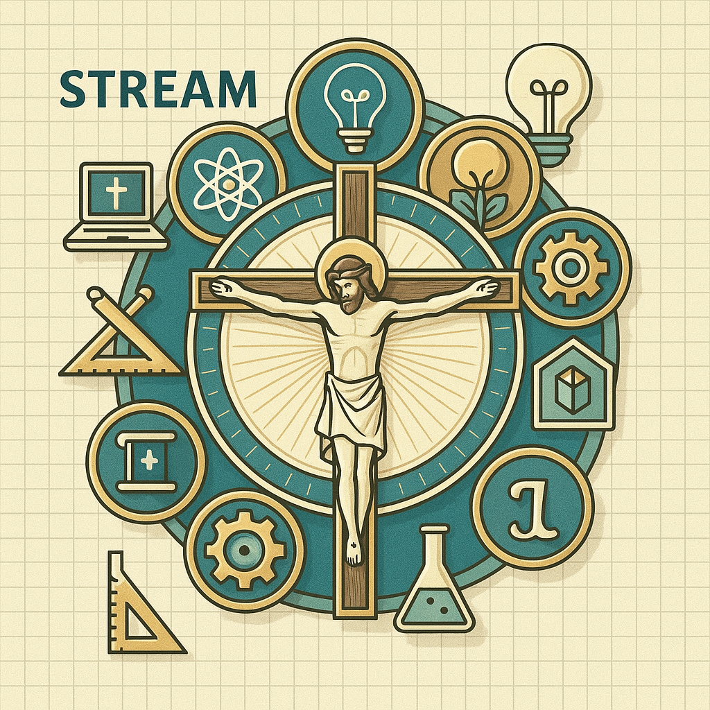

# C-STREAM Framework

-   :material-school:{ .lg .middle } **Catholic · Science · Technology · Religion · Engineering · Arts · Math**

    ---

    A Catholic STEM framework integrating faith and reason throughout every aspect of the curriculum, built on research-backed success factors from NCEA.

    [:octicons-arrow-right-24: Quick Start Guide](Resources/Quick_Start_Guide.md)

{ align=right width=230 }

## Welcome to C-STREAM

C-STREAM represents **Catholic** STEM education that intentionally weaves together faith and reason throughout every aspect of the curriculum. Rather than treating religion as a standalone subject, this framework integrates Catholic identity like "yeast that causes everything to rise."

!!! quote "Our Vision"
    "Science and faith are complementary – the beautiful harmony of faith and reason so students can be a light in the secular world."

---

## :clock3: Lesson Time Frames by Grade

| Grade Level | Session Length | Notes |
|-------------|----------------|-------|
| **Kindergarten** | 25 minutes | Focus on wonder, exploration, simple hands-on activities |
| **Grades 1-2** | 30 minutes | Guided exploration with structured activities |
| **Grades 3-4** | 40 minutes | Independent work with collaboration opportunities |
| **Grades 5-6** | 45 minutes | Complex projects, deeper investigation, student-led inquiry |

---

## :calendar: Scheduling Flexibility

C-STREAM offers two scheduling options to fit your school's needs:

=== "Weekly Lessons (34/year)"

    Full curriculum for schools with STREAM every week.
    
    - [Kindergarten](Lessons/Kindergarten/README.md)
    - [Grades 1-2 Year A](Lessons/Grades_1-2_YearA/README.md) | [Year B](Lessons/Grades_1-2_YearB/README.md)
    - [Grades 3-4 Year A](Lessons/Grades_3-4_YearA/README.md) | [Year B](Lessons/Grades_3-4_YearB/README.md)
    - [Grades 5-6 Year A](Lessons/Grades_5-6_YearA/README.md) | [Year B](Lessons/Grades_5-6_YearB/README.md)

=== "Bi-Weekly Lessons (17/year)"

    Condensed curriculum for schools with STREAM every other week.
    
    - [Kindergarten](Lessons/Bi-Weekly/Kindergarten/README.md)
    - [Grades 1-2 Year A](Lessons/Bi-Weekly/Grades_1-2_YearA/README.md) | [Year B](Lessons/Bi-Weekly/Grades_1-2_YearB/README.md)
    - [Grades 3-4 Year A](Lessons/Bi-Weekly/Grades_3-4_YearA/README.md) | [Year B](Lessons/Bi-Weekly/Grades_3-4_YearB/README.md)
    - [Grades 5-6 Year A](Lessons/Bi-Weekly/Grades_5-6_YearA/README.md) | [Year B](Lessons/Bi-Weekly/Grades_5-6_YearB/README.md)

### Two-Year Rotation (Grades 1-6)

For combined-grade classrooms, we offer **Year A** and **Year B** versions:

- **Year A & Year B** cover the same core skills with different projects, saints, and contexts

- Students never repeat content in back-to-back years

- Kindergarten has a single track (students only experience it once)

---

## :compass: Quick Navigation

-   :material-calendar-check:{ .lg .middle } **Planning**

    ---

    - [Year Planner](C-STREAM_Year_Planner.md)
    - [Lesson Index](C-STREAM_Lesson_Index.md)
    - [CSCOE Library Guide](Resources/CSCOE_Library_Planning_Guide.md)

-   :material-file-document-edit:{ .lg .middle } **Templates**

    ---

    - [Lesson Plan Template](Templates/Lesson_Plan_Template.md)
    - [PBL Template](Templates/Project_Based_Learning_Template.md)
    - [Cross-Curricular Unit](Templates/Cross_Curricular_Unit_Template.md)

-   :material-clipboard-check:{ .lg .middle } **Assessment**

    ---

    - [Faith-Reason Rubric](Rubrics/Faith_Reason_Integration_Rubric.md)
    - [Service Rubric](Rubrics/Service_Oriented_STEM_Rubric.md)
    - [21st Century Skills](Rubrics/21st_Century_Skills_Assessment.md)

-   :material-book-open-variant:{ .lg .middle } **Resources**

    ---

    - [Quick Start Guide](Resources/Quick_Start_Guide.md)
    - [Catholic Scientists](Resources/Catholic_Scientists_Heritage.md)
    - [Substitute Plans](Resources/Substitute_Teacher_Guide.md)

---

## :star: What Makes C-STREAM Special

The **"A" in C-STREAM** encompasses **Arts** (both visual and musical), emphasizing digital creation tools:

- :art: **Digital Art**: Drawing apps, graphic design, animation, 3D modeling

- :musical_note: **Digital Music**: Composition apps, sound design, audio editing, coding music

---

## :trophy: The 12 Success Factors

This framework is built on twelve research-backed success factors for Catholic STEM programs:

??? abstract "1. :pray: Faith-Reason Integration"
    Present science and faith as complementary, using STEM subjects as "privileged gateways into the divine order of things."

??? abstract "2. :clipboard: NCEA's 10 Characteristics"
    Alignment with National Catholic Education Association standards for excellence in Catholic STEM education.

??? abstract "3. :wrench: Hands-On, Project-Based Learning"
    Students apply leading-edge technology to "hands-on, minds-on projects" that build critical thinking and collaboration.

??? abstract "4. :heart: Service-Oriented STEM Applications"
    Connect STEM skills to Catholic social teaching through "Hands and Feet of Christ" projects.

??? abstract "5. :link: Cross-Curricular Integration"
    Intentionally connect disciplines – math, science, art, music, religion, and language arts.

??? abstract "6. :balance_scale: Balance with Traditional Subjects"
    STEM receives emphasis but not at the expense of other subjects; maintain the whole-child approach.

??? abstract "7. :seedling: Start Early"
    Begin high-quality STEM education as soon as children enter elementary school.

??? abstract "8. :woman_teacher: Teacher Professional Development"
    Investment in educator training on bringing faith and reason together in the classroom.

??? abstract "9. :bulb: 21st Century Skills Focus"
    Emphasize problem-solving, communication, collaboration, and critical thinking.

??? abstract "10. :church: Catholic Heritage in Science"
    Leverage the Church's rich scientific legacy (Mendel, Copernicus, Pasteur, Lemaître, and more).

??? abstract "11. :handshake: Community and Industry Partnerships"
    External connections with parishes, universities, and industry partners enhance programs.

??? abstract "12. :sparkles: Wonder and Curiosity as Foundation"
    Approach education from the perspective of wonder, exploration, and faith.

---

## :date: Year at a Glance

| Term | Weeks | Focus |
|------|-------|-------|
| **Fall** | 1-12 | Exploration, wonder, establishing routines |
| **Winter** | 13-22 | Deeper investigation, long-arc projects |
| **Spring** | 23-34 | Application, service projects, celebration |

**Lesson Mix (34 sessions):**

- :blue_circle: **10-15 Single-Week Lessons** - Self-contained explorations

- :green_circle: **8-10 Multi-Week Units** (2-4 weeks each) - Deeper investigations

- :orange_circle: **4-6 Long-Arc Projects** (5-8 weeks each) - Major engineering challenges

---

## :rocket: Getting Started

1. **Read the [Quick Start Guide](Resources/Quick_Start_Guide.md)** - Get up and running in 30 minutes
2. **Review the [Year Planner](C-STREAM_Year_Planner.md)** - See the full 34-week structure
3. **Browse the [Lesson Index](C-STREAM_Lesson_Index.md)** - Find lessons by type, grade, or topic
4. **Check [Materials Inventory](Resources/Materials_Inventory_Checklist.md)** - Gather supplies
5. **Request [CSCOE Materials](Resources/CSCOE_Library_Planning_Guide.md)** - 2 weeks ahead

---

!!! info "About This Framework"
    C-STREAM Framework is developed for **Our Lady of the Prairie Catholic School** in Belle Plaine, MN, part of the Archdiocese of Saint Paul and Minneapolis.
    
    [:octicons-mark-github-16: View on GitHub](https://github.com/bonJoeV/C-STREAM) · [:material-file-document: License](LICENSE.md) · [:material-account-group: Contributing](CONTRIBUTING.md)
